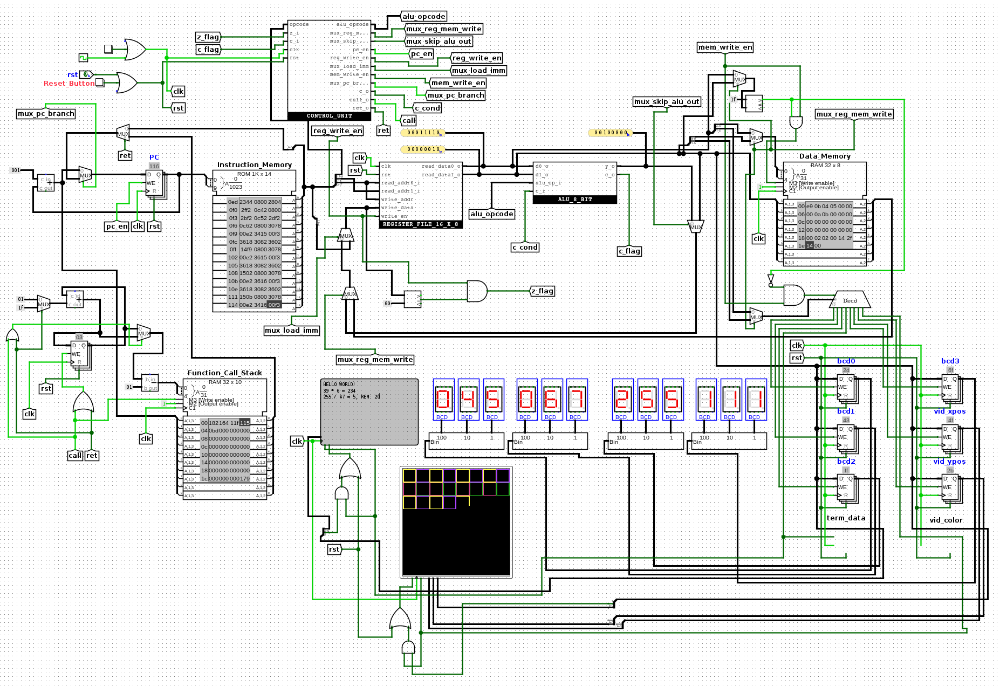

# 8-bit Processor in Logisim

8-bit single-cycle processor based on the very simple 8-bit processor design from the University of Valladolid which can be seen [here](https://www.deeper.uva.es/pages/spg/docs/Conferences/FPGAworld2006a.pdf), created in logisim and with VHDL and Verilog implementations.

Some changes were made to simplify the design and instruction set, notably there are no interrupts and port addressing is limited. Other than that, most of the instruction set has been implemented. There is also an assembler written in Python that can convert assembly instructions to hex code that can be loaded into the ROM on Logisim, allowing you to run programs within Logisim and see how the processor works in real time.

There are a couple libraries and examples written in assembly that can be run on the processor.



## How to assemble and run

To assemble an assembly file, run the assembler with the assembly file as an argument. This will output a hex file that can be loaded into the ROM in Logisim.

```bash
python assembler.py examples/terminal.asm
```

This will generate a file called `hello.hex` that can be loaded into the ROM in Logisim. Simply right-click on the ROM module labeled `Instruction_Memory` and select `Load Image...` and select the hex file. Then you can click on the simulate tab on the top-left and click on enable clock ticks (third circular button from the left) to start the processor. You can modify the clock speed under the `Simulate` tab at the top. The processor will run the program and you can see the output in the terminal or video output. You can reset the processor by clicking on the `Reset_Button` in the top left of the design.

## Libraries and Examples

### Libraries

* `lib/terminal_lib.asm` - Library for writing to the terminal
* `lib/video_lib.asm` - Library for writing to the video output
* `lib/bcd_lib.asm` - Library for writing to the BCD registers and displaying numbers on the 7-segment displays
* `lib/math_lib.asm` - Library for basic math operations (multiplication, division)

### Examples

* `examples/terminal.asm` - Writes HELLO WORLD! to the terminal as well as multiplication and division operations (using math_lib.asm). Operands can be changed by modifying the #define at the top of the file.
* `examples/video.asm` - Writes a pattern to the video output with squares and colors
* `examples/prime.asm` - Calculates prime numbers up to 231 and writes them to the terminal. This will take forever if you plan on reaching 231.
* `examples/fib.asm` - Calculates the 13th Fibonacci number and writes it to the 7 segment display.

## Instruction Set

Instruction | Description
------------|-------------
call \<dest\> | Call to subroutine at address \<dest\>
goto \<dest\> | Jump to address \<dest\>
ret | Return from subroutine
lw \<dest\>, \<src\> | Load value from memory address \<src\> into register \<dest\>
lwi \<dest\>, \<src\> | Load immediate value \<src\> into register \<dest\>
sw \<dest\>, \<src\> | Store value from register \<src\> into memory address \<dest\>
mov \<dest\>, \<src\> | Move value from register \<src\> into register \<dest\>
add \<dest\>, \<src\> | Add value from register \<src\> to register \<dest\>
adc \<dest\>, \<src\> | Add value from register \<src\> to register \<dest\> with carry
sub \<dest\>, \<src\> | Subtract value from register \<src\> from register \<dest\>
sbc \<dest\>, \<src\> | Subtract value from register \<src\> from register \<dest\> with carry
xnor \<dest\>, \<src\> | XNOR value from register \<src\> with register \<dest\>
or \<dest\>, \<src\> | OR value from register \<src\> with register \<dest\>
and \<dest\>, \<src\> | AND value from register \<src\> with register \<dest\>
asr \<dest\> | Arithmetic shift right register \<dest\>
rrc \<dest\> | Rotate right through carry register \<dest\>
ror \<dest\> | Rotate right register \<dest\>
rol \<dest\> | Rotate left register \<dest\>
jpZ \<dest\> | Jump to address \<dest\> if zero flag is set
jpNZ \<dest\> | Jump to address \<dest\> if zero flag is not set
jpC \<dest\> | Jump to address \<dest\> if carry flag is set
jpNC \<dest\> | Jump to address \<dest\> if carry flag is not set

### Macro Instructions

Macro Instruction | Description
------------------|-------------
nop | No operation
inc \<dest\> | Increment register \<dest\>
dec \<dest\> | Decrement register \<dest\>
not \<dest\> | NOT register \<dest\>
neg \<dest\> | Negate register \<dest\>
xor \<dest\>, \<src\> | XOR value from register \<src\> with register \<dest\>
cmp \<dest\>, \<src\> | Compare value from register \<src\> with register \<dest\>
andi \<dest\>, \<src\> | AND immediate value \<src\> with register \<dest\>
ori \<dest\>, \<src\> | OR immediate value \<src\> with register \<dest\>
xori \<dest\>, \<src\> | XOR immediate value \<src\> with register \<dest\>
addi \<dest\>, \<src\> | Add immediate value \<src\> to register \<dest\>
adci \<dest\>, \<src\> | Add immediate value \<src\> to register \<dest\> with carry
subi \<dest\>, \<src\> | Subtract immediate value \<src\> from register \<dest\>
sbci \<dest\>, \<src\> | Subtract immediate value \<src\> from register \<dest\> with carry
clr \<dest\> | Clear register \<dest\>
setC | Set carry flag
clrC | Clear carry flag
rlc | Rotate left through carry
sl0 \<dest\> | Shift left register \<dest\> adding 0
sl1 \<dest\> | Shift left register \<dest\> adding 1
sr0 \<dest\> | Shift right register \<dest\> adding 0
sr1 \<dest\> | Shift right register \<dest\> adding 1
push \<src\> | Push register \<src\> onto stack
pop \<dest\> | Pop value from stack into register \<dest\>
halt | Halt processor

### Assembly Directives

Directive | Description
----------|-------------
#include \<file\> | Include file in assembly
#define \<name\> \<value\> | Define a constant

### Special Registers

Register | Description
---------|-------------
$0 | Constant 0
$1 | Constant 1
$2 | Temporary register
$3 | Stack pointer

## Memory addressing

* 8-bit memory addresses, first 5 bits for RAM, last 3 bits for specific memory ports xxxy yyyy
* Can store 8-bit words to RAM locations 0x00 to 0x1E
* 8 memory locations are mapped to ports. These ports are linked to different devices and registers in the logisim design.
  * Port 0 (BCD0 Register): 0x1F
  * Port 1 (BCD1 Register): 0x3F
  * Port 2 (BCD2 Register): 0x5F
  * Port 3 (Terminal Input): 0x7F
  * Port 4 (BCD3 Register): 0x9F
  * Port 5 (Video X register): 0xBF
  * Port 6 (Video Y register): 0xDF
  * Port 7 (Video Color Input): 0xFF

## Logisim Ports

In the Logisim circuit, you have access to 4 BCDs, 1 Terminal, and 1 128 x 128 Video Output with Atari 2600 color palette (7 bits).

* Bit 7 in terminal input clears the terminal, and bit 7 in video color input clears the video output.

## Limitations

* No interrupts
* Can only store to ram locations 0x00 to 0x1E
* Maximum of 1024 instructions
* Max call depth of 32
* Max stack size of 31, shared with RAM
